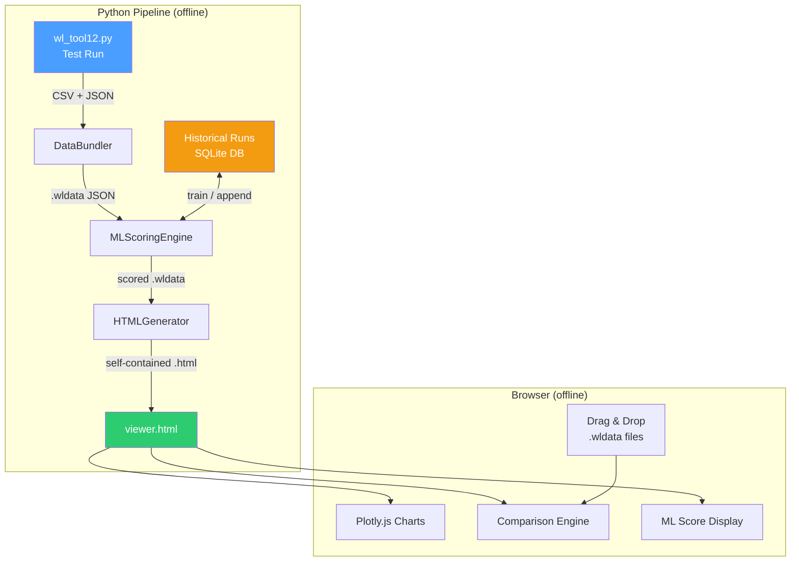
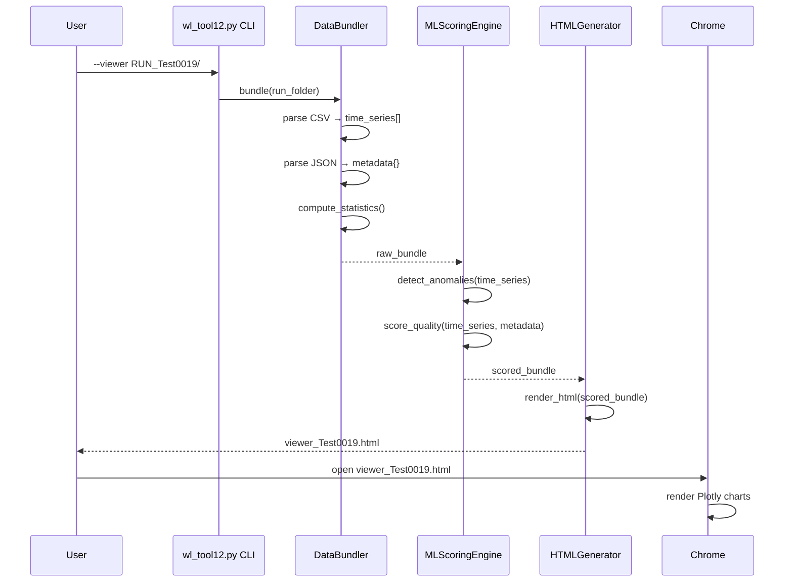
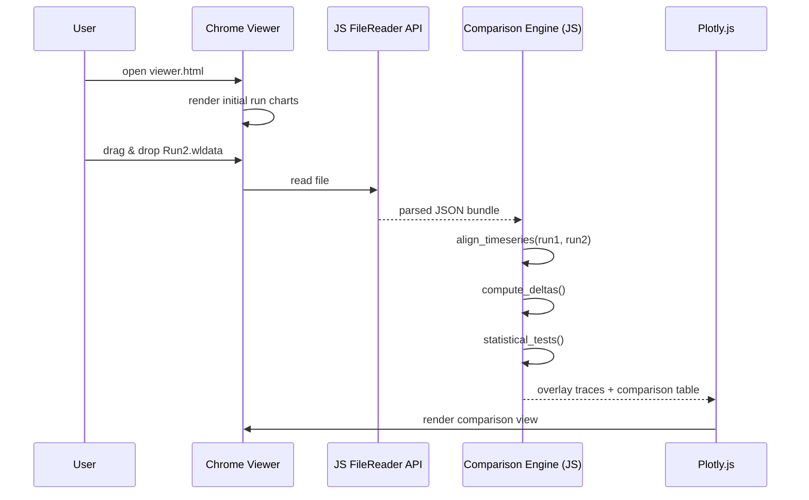

# Design Document: Offline Data Viewer

## Overview

The Offline Data Viewer is a self-contained, browser-based interactive visualization system for WiFi diagnostic test runs produced by `wl_tool12.py`. It consists of three Python-side components — a data bundler, an ML scoring engine, and an HTML generator — that together produce a single `.html` file a user can open in Chrome with no server or internet connection.

Each test run's CSV time-series data (RSSI, SNR, MCS, Tx Rate, Latency, Distance, etc.), JSON metadata (roaming events, interference log, mesh analysis), and computed ML quality scores are packaged into a `.wldata` JSON bundle. The HTML viewer embeds Plotly.js and provides interactive charts with zoom, pan, hover tooltips, multi-run comparison with overlay charts, statistical comparison tables, and ML-driven anomaly highlighting. Users can also drag-and-drop additional `.wldata` bundles into the viewer at runtime to compare runs side-by-side.

The ML pipeline uses scikit-learn's `IsolationForest` for anomaly detection and `GradientBoostingRegressor` for quality scoring. Models are trained offline in Python, and inference results are pre-computed and embedded in each `.wldata` bundle so the HTML viewer has zero ML dependencies.

## Architecture



## Sequence Diagrams

### Single-Run Viewer Generation



### Multi-Run Comparison Flow



## Components and Interfaces

### Component 1: DataBundler

**Purpose**: Reads a test run folder (CSV + JSON) and produces a normalized `.wldata` JSON bundle containing all data needed for visualization.

**Interface**:
```python
class DataBundler:
    def bundle(self, run_folder: str) -> WLDataBundle:
        """Parse a RUN_* folder and return a structured bundle."""
        ...

    def parse_csv(self, csv_path: str) -> list[TimeSeriesRow]:
        """Parse diagnostics CSV into typed row objects."""
        ...

    def parse_json(self, json_path: str) -> RunMetadata:
        """Parse diagnostics JSON into metadata object."""
        ...

    def compute_statistics(self, rows: list[TimeSeriesRow]) -> RunStatistics:
        """Compute per-metric min/max/mean/median/std/p95/p5."""
        ...

    def save_bundle(self, bundle: WLDataBundle, output_path: str) -> None:
        """Serialize bundle to .wldata JSON file."""
        ...
```

**Responsibilities**:
- Discover CSV and JSON files inside a `RUN_*` folder by naming convention
- Handle missing or malformed values (`N/A`, negative SNR, zero Tx Rate)
- Normalize column names to a canonical schema
- Compute summary statistics for each metric
- Produce a deterministic, versioned `.wldata` JSON file

### Component 2: MLScoringEngine

**Purpose**: Applies anomaly detection and quality scoring to a data bundle using pre-trained scikit-learn models. Manages model training from historical data stored in SQLite.

**Interface**:
```python
class MLScoringEngine:
    def __init__(self, db_path: str = "~/.wl_tool/ml_history.db"):
        ...

    def score_bundle(self, bundle: WLDataBundle) -> ScoredBundle:
        """Run anomaly detection + quality scoring on a bundle."""
        ...

    def detect_anomalies(self, time_series: list[TimeSeriesRow]) -> list[Anomaly]:
        """Use IsolationForest to flag anomalous iterations."""
        ...

    def score_quality(self, bundle: WLDataBundle) -> QualityScore:
        """Compute 0-100 quality score using GradientBoosting model."""
        ...

    def append_to_history(self, bundle: WLDataBundle) -> None:
        """Store run data in SQLite for future model training."""
        ...

    def retrain(self) -> None:
        """Retrain models from all historical data in SQLite."""
        ...
```

**Responsibilities**:
- Load or initialize scikit-learn models from disk (`~/.wl_tool/models/`)
- Build feature vectors from time-series data: `[RSSI, SNR, MCS, TxRate, Latency, ChannelUtil, Distance]`
- Flag individual iterations as anomalous (sudden RSSI drops, MCS instability, interference)
- Produce an overall 0-100 quality score per run
- Fall back to rule-based scoring (mirroring existing `evaluate_network_health_advanced`) when no trained model exists
- Append each scored run to SQLite history for incremental learning

### Component 3: HTMLGenerator

**Purpose**: Produces a self-contained HTML file with embedded Plotly.js, chart configurations, and the scored data bundle(s).

**Interface**:
```python
class HTMLGenerator:
    def generate(
        self,
        bundles: list[ScoredBundle],
        output_path: str,
        title: str = "WiFi Diagnostics Viewer"
    ) -> str:
        """Generate a self-contained HTML viewer file."""
        ...

    def build_chart_configs(self, bundle: ScoredBundle) -> list[PlotlyChartConfig]:
        """Create Plotly trace/layout dicts for each chart type."""
        ...

    def render_comparison_table(self, bundles: list[ScoredBundle]) -> str:
        """Generate HTML table comparing statistics across runs."""
        ...

    def embed_plotly_js(self) -> str:
        """Return the full Plotly.js library as a string for embedding."""
        ...
```

**Responsibilities**:
- Embed the full Plotly.js CDN bundle inline (no external requests)
- Generate chart configurations for: RSSI vs Time, MCS vs Time, Tx Rate vs Time, Latency vs Time, SNR vs Time, Channel Utilization vs Time, Distance vs RSSI scatter, and a combined health dashboard
- Highlight anomalous data points with distinct markers
- Include drag-and-drop JavaScript for loading additional `.wldata` files at runtime
- Generate tabbed UI for single-run detail view vs. multi-run comparison view
- Produce valid, self-contained HTML that works in Chrome with `file://` protocol

### Component 4: ComparisonEngine (JavaScript, embedded in HTML)

**Purpose**: Client-side JavaScript module embedded in the viewer HTML that handles multi-run overlay, statistical comparison, and delta computation.

**Interface**:
```python
# This component runs in the browser as JavaScript.
# Interface shown here in Python-style for consistency.

class ComparisonEngine:
    def load_bundle(self, wldata_json: dict) -> None:
        """Parse a dropped .wldata file and add to comparison set."""
        ...

    def align_timeseries(self, run_a: dict, run_b: dict) -> AlignedData:
        """Align two runs by iteration index or elapsed time."""
        ...

    def compute_deltas(self, aligned: AlignedData) -> DeltaTable:
        """Compute per-metric differences between two aligned runs."""
        ...

    def statistical_tests(self, run_a: dict, run_b: dict) -> StatResults:
        """Run t-test and Mann-Whitney U on each metric pair."""
        ...

    def render_overlay(self, runs: list[dict]) -> None:
        """Update Plotly charts with overlaid traces from all loaded runs."""
        ...
```

**Responsibilities**:
- Accept `.wldata` files via drag-and-drop using the FileReader API
- Align time-series data across runs (by iteration index or normalized elapsed time)
- Compute statistical significance of metric differences (t-test, Mann-Whitney U)
- Render overlay charts with color-coded traces per run
- Generate delta tables with pass/fail disposition against configurable thresholds

## Data Models

### WLDataBundle (`.wldata` file format)

```python
from dataclasses import dataclass, field
from typing import Optional

@dataclass
class TimeSeriesRow:
    iteration: int
    timestamp_s: float
    ssid: str
    channel: str
    bssid: str
    rssi_dbm: float
    snr_db: float
    noise_dbm: float
    tx_rate_mbps: float
    latency_ms: float
    mcs_index: int
    phy_mode: str          # "11ax", "11ac", "11n"
    nss: int
    channel_util_pct: float
    distance_m: float
    health_status: str     # "Excellent", "Good", "Bad"

@dataclass
class RoamingEvent:
    timestamp: float
    from_bssid: str
    to_bssid: str

@dataclass
class InterferenceEvent:
    timestamp: float
    issues: list[str]

@dataclass
class RunMetadata:
    test_name: str
    timestamp: str         # ISO 8601
    ssid: str
    channel: str
    bssid: str
    total_iterations: int
    total_roaming_events: int
    interference_incidents: int
    unique_bssids: int
    roaming_events: list[RoamingEvent]
    interference_log: list[InterferenceEvent]

@dataclass
class RunStatistics:
    """Per-metric summary statistics."""
    rssi: MetricStats
    snr: MetricStats
    tx_rate: MetricStats
    latency: MetricStats
    mcs: MetricStats
    channel_util: MetricStats
    distance: MetricStats

@dataclass
class MetricStats:
    min: float
    max: float
    mean: float
    median: float
    std: float
    p5: float
    p95: float

@dataclass
class Anomaly:
    iteration: int
    timestamp_s: float
    anomaly_type: str      # "rssi_drop", "mcs_instability", "interference", "latency_spike"
    severity: str          # "low", "medium", "high"
    description: str
    affected_metrics: dict  # metric_name -> value at anomaly point

@dataclass
class QualityScore:
    overall: int           # 0-100
    mcs_score: int         # 0-50
    snr_score: int         # 0-35
    nss_score: int         # 0-15
    status: str            # "Excellent", "Good", "Fair", "Poor"
    details: list[str]
    model_used: str        # "gradient_boosting" or "rule_based"

@dataclass
class WLDataBundle:
    version: str = "1.0"
    test_name: str = ""
    generated_at: str = ""
    time_series: list[TimeSeriesRow] = field(default_factory=list)
    metadata: Optional[RunMetadata] = None
    statistics: Optional[RunStatistics] = None
    quality_score: Optional[QualityScore] = None
    anomalies: list[Anomaly] = field(default_factory=list)
```

**Validation Rules**:
- `version` must be a semver string matching `^\d+\.\d+$`
- `time_series` must have at least 1 row
- `rssi_dbm` must be in range `[-120, 0]`
- `mcs_index` must be in range `[0, 12]`
- `snr_db` must be in range `[-50, 100]` (negative SNR is valid per existing data)
- `latency_ms` must be non-negative; `N/A` values are stored as `-1`
- `tx_rate_mbps` must be non-negative; `0` indicates measurement failure
- `quality_score.overall` must be in range `[0, 100]`
- `anomaly.severity` must be one of `"low"`, `"medium"`, `"high"`


## Algorithmic Pseudocode

### Data Bundling Algorithm

```python
def bundle(run_folder: str) -> WLDataBundle:
    """
    ALGORITHM: Bundle a test run folder into a .wldata file.
    INPUT: run_folder — path to a RUN_* directory
    OUTPUT: WLDataBundle with all data, statistics, and metadata
    """
    # Step 1: Discover files
    csv_path = glob(f"{run_folder}/diagnostics_*.csv")[0]
    json_path = glob(f"{run_folder}/diagnostics_*.json")[0]
    test_name = extract_test_name(csv_path)  # e.g., "Test0019"

    # Step 2: Parse CSV time-series
    time_series = []
    for row in read_csv(csv_path, skip_header=True):
        ts_row = TimeSeriesRow(
            iteration=int(row["Iteration"]),
            timestamp_s=float(row["Timestamp_s"]),
            ssid=row["SSID"],
            channel=row["Channel"],
            bssid=row["BSSID"],
            rssi_dbm=safe_float(row["RSSI_dBm"]),
            snr_db=safe_float(row["SNR_dB"]),
            noise_dbm=safe_float(row["Noise_dBm"]),
            tx_rate_mbps=safe_float(row["TxRate_Mbps"]),
            latency_ms=safe_float(row["Latency_ms"], default=-1),
            mcs_index=safe_int(row["MCS_Index"], default=-1),
            phy_mode=row["PHY_Mode"],
            nss=safe_int(row["NSS"], default=1),
            channel_util_pct=safe_float(row["ChannelUtil_%"]),
            distance_m=safe_float(row["Distance_m"]),
            health_status=row["Health_Status"],
        )
        time_series.append(ts_row)

    # Step 3: Parse JSON metadata
    metadata = parse_json(json_path)

    # Step 4: Compute statistics
    statistics = compute_statistics(time_series)

    # Step 5: Assemble bundle
    bundle = WLDataBundle(
        version="1.0",
        test_name=test_name,
        generated_at=datetime.now().isoformat(),
        time_series=time_series,
        metadata=metadata,
        statistics=statistics,
    )
    return bundle
```

**Preconditions:**
- `run_folder` exists and contains exactly one `diagnostics_*.csv` and one `diagnostics_*.json`
- CSV file has the 16-column header: `Iteration,Timestamp_s,SSID,Channel,BSSID,RSSI_dBm,SNR_dB,Noise_dBm,TxRate_Mbps,Latency_ms,MCS_Index,PHY_Mode,NSS,ChannelUtil_%,Distance_m,Health_Status`

**Postconditions:**
- Returned bundle has `len(time_series) >= 1`
- All numeric fields are floats/ints (no string `"N/A"` values; missing → sentinel `-1`)
- `statistics` contains valid min/max/mean/median/std/p5/p95 for each metric

### Anomaly Detection Algorithm

```python
def detect_anomalies(time_series: list[TimeSeriesRow]) -> list[Anomaly]:
    """
    ALGORITHM: Detect anomalous iterations using IsolationForest + rule-based checks.
    INPUT: time_series — list of per-iteration measurements
    OUTPUT: list of Anomaly objects with type, severity, and description
    """
    anomalies = []

    # Step 1: Build feature matrix for IsolationForest
    features = []
    valid_indices = []
    for i, row in enumerate(time_series):
        if row.latency_ms >= 0 and row.tx_rate_mbps > 0:
            features.append([
                row.rssi_dbm,
                row.snr_db,
                row.mcs_index,
                row.tx_rate_mbps,
                row.latency_ms,
                row.channel_util_pct,
            ])
            valid_indices.append(i)

    # Step 2: Run IsolationForest (contamination=0.1 → expect ~10% anomalies)
    if len(features) >= 10:
        X = np.array(features)
        X_scaled = StandardScaler().fit_transform(X)
        iso_forest = IsolationForest(contamination=0.1, random_state=42)
        predictions = iso_forest.fit_predict(X_scaled)
        # predictions: 1 = normal, -1 = anomaly

        for j, pred in enumerate(predictions):
            if pred == -1:
                idx = valid_indices[j]
                row = time_series[idx]
                anomalies.append(Anomaly(
                    iteration=row.iteration,
                    timestamp_s=row.timestamp_s,
                    anomaly_type="statistical_outlier",
                    severity=classify_severity(row, time_series),
                    description=describe_anomaly(row, time_series),
                    affected_metrics=build_affected_dict(row),
                ))

    # Step 3: Rule-based checks (always run, even with few data points)
    for i in range(1, len(time_series)):
        prev, curr = time_series[i - 1], time_series[i]

        # RSSI drop > 15 dBm between consecutive iterations
        if prev.rssi_dbm - curr.rssi_dbm > 15:
            anomalies.append(Anomaly(
                iteration=curr.iteration,
                timestamp_s=curr.timestamp_s,
                anomaly_type="rssi_drop",
                severity="high",
                description=f"RSSI dropped {prev.rssi_dbm - curr.rssi_dbm:.0f} dBm "
                            f"({prev.rssi_dbm} → {curr.rssi_dbm})",
                affected_metrics={"rssi_dbm": curr.rssi_dbm},
            ))

        # MCS instability: drop of 4+ MCS levels
        if prev.mcs_index - curr.mcs_index >= 4 and prev.mcs_index >= 0:
            anomalies.append(Anomaly(
                iteration=curr.iteration,
                timestamp_s=curr.timestamp_s,
                anomaly_type="mcs_instability",
                severity="medium",
                description=f"MCS dropped {prev.mcs_index - curr.mcs_index} levels "
                            f"({prev.mcs_index} → {curr.mcs_index})",
                affected_metrics={"mcs_index": curr.mcs_index},
            ))

        # Latency spike: > 3x the running average
        if i >= 3:
            recent_avg = np.mean([
                ts.latency_ms for ts in time_series[max(0, i-3):i]
                if ts.latency_ms >= 0
            ])
            if recent_avg > 0 and curr.latency_ms > 3 * recent_avg:
                anomalies.append(Anomaly(
                    iteration=curr.iteration,
                    timestamp_s=curr.timestamp_s,
                    anomaly_type="latency_spike",
                    severity="high" if curr.latency_ms > 5 * recent_avg else "medium",
                    description=f"Latency spike: {curr.latency_ms:.1f}ms "
                                f"(avg was {recent_avg:.1f}ms)",
                    affected_metrics={"latency_ms": curr.latency_ms},
                ))

    # Step 4: Deduplicate (same iteration may be flagged by both methods)
    return deduplicate_anomalies(anomalies)
```

**Preconditions:**
- `time_series` has at least 1 row
- Numeric fields contain valid floats (no `N/A` strings)

**Postconditions:**
- Each anomaly references a valid iteration present in `time_series`
- No duplicate anomalies for the same iteration + anomaly_type
- Severity is one of `"low"`, `"medium"`, `"high"`

**Loop Invariants:**
- Rule-based loop: `anomalies` contains only anomalies from iterations `[1..i]`
- All anomalies have valid `iteration` and `timestamp_s` fields

### Quality Scoring Algorithm

```python
def score_quality(bundle: WLDataBundle) -> QualityScore:
    """
    ALGORITHM: Score a test run's WiFi quality 0-100.
    Uses GradientBoosting model if available, falls back to rule-based scoring.
    INPUT: bundle — complete data bundle with time_series and metadata
    OUTPUT: QualityScore with overall score, sub-scores, and status
    
    Scoring weights (rule-based fallback):
      MCS Index:  50 points  (primary quality indicator)
      SNR:        35 points  (signal quality)
      NSS:        15 points  (MIMO capability)
    """
    time_series = bundle.time_series

    # Try ML model first
    model_path = os.path.expanduser("~/.wl_tool/models/quality_model.pkl")
    if os.path.exists(model_path):
        model = joblib.load(model_path)
        feature_vector = extract_run_features(time_series)
        overall = int(np.clip(model.predict([feature_vector])[0], 0, 100))
        return QualityScore(
            overall=overall,
            mcs_score=-1,  # ML model provides single score
            snr_score=-1,
            nss_score=-1,
            status=score_to_status(overall),
            details=["Scored by GradientBoosting model"],
            model_used="gradient_boosting",
        )

    # Rule-based fallback (mirrors evaluate_network_health_advanced)
    valid_rows = [r for r in time_series if r.mcs_index >= 0 and r.snr_db > -50]
    if not valid_rows:
        return QualityScore(0, 0, 0, 0, "Unknown", ["Insufficient data"], "rule_based")

    avg_mcs = np.mean([r.mcs_index for r in valid_rows])
    avg_snr = np.mean([r.snr_db for r in valid_rows])
    avg_nss = np.mean([r.nss for r in valid_rows])

    # MCS scoring (50 points)
    if avg_mcs >= 8:
        mcs_score = 50
    elif avg_mcs >= 5:
        mcs_score = 35
    elif avg_mcs >= 3:
        mcs_score = 20
    else:
        mcs_score = 10

    # SNR scoring (35 points)
    if avg_snr >= 35:
        snr_score = 35
    elif avg_snr >= 25:
        snr_score = 28
    elif avg_snr >= 20:
        snr_score = 20
    elif avg_snr >= 15:
        snr_score = 12
    else:
        snr_score = 5

    # NSS scoring (15 points)
    if avg_nss >= 4:
        nss_score = 15
    elif avg_nss >= 3:
        nss_score = 12
    elif avg_nss >= 2:
        nss_score = 8
    else:
        nss_score = 4

    overall = min(mcs_score + snr_score + nss_score, 100)
    status = score_to_status(overall)

    return QualityScore(
        overall=overall,
        mcs_score=mcs_score,
        snr_score=snr_score,
        nss_score=nss_score,
        status=status,
        details=[
            f"MCS: {avg_mcs:.1f} avg → {mcs_score}/50",
            f"SNR: {avg_snr:.1f} dB avg → {snr_score}/35",
            f"NSS: {avg_nss:.1f} avg → {nss_score}/15",
        ],
        model_used="rule_based",
    )
```

**Preconditions:**
- `bundle.time_series` has at least 1 row
- If ML model file exists, it is a valid scikit-learn `GradientBoostingRegressor` pickle

**Postconditions:**
- `overall` is in `[0, 100]`
- `status` is one of `"Excellent"`, `"Good"`, `"Fair"`, `"Poor"`, `"Unknown"`
- `model_used` is either `"gradient_boosting"` or `"rule_based"`

### HTML Generation Algorithm

```python
def generate(
    bundles: list[ScoredBundle],
    output_path: str,
    title: str = "WiFi Diagnostics Viewer",
) -> str:
    """
    ALGORITHM: Generate a self-contained HTML viewer.
    INPUT: scored bundles, output file path, page title
    OUTPUT: path to generated HTML file
    """
    # Step 1: Load Plotly.js source (bundled with package)
    plotly_js = load_plotly_js_source()

    # Step 2: Build chart configurations for each bundle
    all_charts = {}
    for bundle in bundles:
        charts = build_chart_configs(bundle)
        all_charts[bundle.test_name] = charts

    # Step 3: Serialize bundle data for embedding
    embedded_data = json.dumps(
        [asdict(b) for b in bundles],
        default=str,
    )

    # Step 4: Render HTML from template
    html = HTML_TEMPLATE.format(
        title=title,
        plotly_js=plotly_js,
        chart_configs=json.dumps(all_charts),
        embedded_data=embedded_data,
        comparison_js=COMPARISON_ENGINE_JS,
        drag_drop_js=DRAG_DROP_HANDLER_JS,
        styles=VIEWER_CSS,
    )

    # Step 5: Write to file
    with open(output_path, "w") as f:
        f.write(html)

    return output_path
```

**Preconditions:**
- `bundles` has at least 1 scored bundle
- Plotly.js source file is available at the expected package path
- `output_path` is a writable file path

**Postconditions:**
- Output file is valid HTML5 that renders in Chrome via `file://` protocol
- All JavaScript and CSS are inline (no external requests)
- Embedded data is valid JSON parseable by `JSON.parse()`

### Statistical Comparison Algorithm (JavaScript)

```python
def statistical_tests(run_a: dict, run_b: dict) -> dict:
    """
    ALGORITHM: Compare two runs using statistical tests.
    Runs in the browser as JavaScript (shown in Python for clarity).
    INPUT: run_a, run_b — parsed .wldata bundle dicts
    OUTPUT: dict of metric_name → {t_stat, p_value, significant, mann_whitney_u, mw_p_value}
    """
    metrics = ["rssi_dbm", "snr_db", "mcs_index", "tx_rate_mbps", "latency_ms"]
    results = {}

    for metric in metrics:
        values_a = [row[metric] for row in run_a["time_series"] if row[metric] >= 0]
        values_b = [row[metric] for row in run_b["time_series"] if row[metric] >= 0]

        if len(values_a) < 2 or len(values_b) < 2:
            results[metric] = {"error": "Insufficient data"}
            continue

        # Welch's t-test (unequal variances)
        mean_a, mean_b = mean(values_a), mean(values_b)
        var_a, var_b = variance(values_a), variance(values_b)
        n_a, n_b = len(values_a), len(values_b)

        t_stat = (mean_a - mean_b) / sqrt(var_a / n_a + var_b / n_b)
        df = ((var_a / n_a + var_b / n_b) ** 2 /
              ((var_a / n_a) ** 2 / (n_a - 1) + (var_b / n_b) ** 2 / (n_b - 1)))
        p_value = 2 * (1 - t_cdf(abs(t_stat), df))

        # Mann-Whitney U test
        u_stat, mw_p = mann_whitney_u(values_a, values_b)

        results[metric] = {
            "mean_a": mean_a,
            "mean_b": mean_b,
            "delta": mean_a - mean_b,
            "t_stat": t_stat,
            "p_value": p_value,
            "significant": p_value < 0.05,
            "mann_whitney_u": u_stat,
            "mw_p_value": mw_p,
        }

    return results
```

**Preconditions:**
- Both runs have at least 2 valid data points per metric
- Metric values are numeric (sentinel `-1` values are filtered out)

**Postconditions:**
- `significant` is `True` if and only if `p_value < 0.05`
- `delta` equals `mean_a - mean_b` exactly
- All statistical values are finite numbers (no NaN/Infinity)

**Loop Invariants:**
- `results` contains entries only for metrics processed so far
- Each entry has either an `"error"` key or all statistical fields

## Key Functions with Formal Specifications

### safe_float()

```python
def safe_float(value: str, default: float = 0.0) -> float:
    """Convert string to float, handling 'N/A' and empty strings."""
```

**Preconditions:**
- `value` is a string or numeric type

**Postconditions:**
- Returns `float(value)` if parseable, otherwise `default`
- Never raises an exception

### extract_run_features()

```python
def extract_run_features(time_series: list[TimeSeriesRow]) -> list[float]:
    """Build a feature vector summarizing an entire run for ML scoring."""
```

**Preconditions:**
- `time_series` has at least 1 row with valid numeric data

**Postconditions:**
- Returns a fixed-length feature vector: `[mean_rssi, std_rssi, mean_snr, std_snr, mean_mcs, std_mcs, mean_tx, std_tx, mean_latency, std_latency, mean_cu, num_iterations, num_roaming_events, num_interference_events]`
- Length is always 14

### score_to_status()

```python
def score_to_status(score: int) -> str:
    """Map numeric score to status label."""
```

**Preconditions:**
- `score` is in `[0, 100]`

**Postconditions:**
- Returns `"Excellent"` if `score >= 85`
- Returns `"Good"` if `70 <= score < 85`
- Returns `"Fair"` if `50 <= score < 70`
- Returns `"Poor"` if `score < 50`

### deduplicate_anomalies()

```python
def deduplicate_anomalies(anomalies: list[Anomaly]) -> list[Anomaly]:
    """Remove duplicate anomalies for the same iteration + type, keeping highest severity."""
```

**Preconditions:**
- All anomalies have valid `iteration` and `anomaly_type` fields

**Postconditions:**
- No two anomalies share the same `(iteration, anomaly_type)` pair
- When duplicates exist, the one with highest severity is kept (`high > medium > low`)
- Output is sorted by `iteration` ascending

## Example Usage

```python
# Example 1: Generate viewer for a single test run
from offline_data_viewer import DataBundler, MLScoringEngine, HTMLGenerator

bundler = DataBundler()
ml = MLScoringEngine()
gen = HTMLGenerator()

# Bundle the run data
bundle = bundler.bundle("RUN_Test0019/")
bundler.save_bundle(bundle, "RUN_Test0019/Test0019.wldata")

# Score with ML
scored = ml.score_bundle(bundle)
ml.append_to_history(bundle)

# Generate viewer
gen.generate([scored], "viewer_Test0019.html")
# → Opens in Chrome: file:///path/to/viewer_Test0019.html


# Example 2: Multi-run comparison viewer
bundles = []
for folder in ["RUN_Test0019/", "RUN_Beta4/"]:
    bundle = bundler.bundle(folder)
    scored = ml.score_bundle(bundle)
    bundles.append(scored)

gen.generate(bundles, "comparison_viewer.html", title="Test0019 vs Beta4")


# Example 3: CLI integration with wl_tool12.py
# $ python wl_tool12.py --viewer RUN_Test0019/
# $ python wl_tool12.py --viewer RUN_Test0019/ RUN_Beta4/ --compare
# $ python wl_tool12.py --retrain-ml  (retrain from all historical runs)


# Example 4: Drag-and-drop in browser
# 1. Open viewer_Test0019.html in Chrome
# 2. Drag Beta4.wldata onto the page
# 3. Comparison view auto-activates with overlay charts and delta table
```

## Correctness Properties

The following properties must hold for all valid inputs:

1. **Bundle Completeness**: For any valid `RUN_*` folder, `bundle()` produces a `WLDataBundle` where `len(time_series)` equals the number of data rows in the CSV (excluding header).

2. **Idempotent Bundling**: `bundle(folder)` called twice on the same unchanged folder produces identical `WLDataBundle` objects (excluding `generated_at` timestamp).

3. **Score Bounds**: For any bundle, `score_quality(bundle).overall` is in `[0, 100]`.

4. **Anomaly Validity**: For any anomaly in `detect_anomalies(ts)`, `anomaly.iteration` exists in `ts` and `anomaly.severity` is in `{"low", "medium", "high"}`.

5. **Statistical Symmetry**: For any two runs A and B, `|statistical_tests(A, B).delta| == |statistical_tests(B, A).delta|` for each metric.

6. **HTML Self-Containment**: The generated HTML file contains zero external resource references (no `<script src="http...">`, no `<link href="http...">`, no `fetch()` calls).

7. **Comparison Consistency**: If runs A and B have identical time-series data, `statistical_tests(A, B).p_value >= 0.05` for all metrics (identical data should not be flagged as significantly different).

8. **ML Fallback**: When no trained model exists at `~/.wl_tool/models/quality_model.pkl`, `score_quality()` returns a valid `QualityScore` with `model_used == "rule_based"`.

9. **N/A Handling**: No `"N/A"` string values appear in any numeric field of a `WLDataBundle`. All missing values are converted to sentinel values (`-1` for latency, `0.0` for rates).

10. **Drag-Drop Additivity**: Loading N `.wldata` files via drag-and-drop results in exactly N runs displayed in the comparison view, with N distinct trace colors.

## Error Handling

### Error Scenario 1: Missing CSV or JSON in Run Folder

**Condition**: `bundle()` is called on a folder that lacks a `diagnostics_*.csv` or `diagnostics_*.json` file.
**Response**: Raise `BundleError(f"Missing required file in {run_folder}: expected diagnostics_*.csv and diagnostics_*.json")`.
**Recovery**: User is shown the error message with the expected file naming convention.

### Error Scenario 2: Malformed CSV Data

**Condition**: CSV contains rows with unparseable numeric values, wrong column count, or corrupted encoding.
**Response**: Skip malformed rows, log warnings, and continue bundling. If zero valid rows remain, raise `BundleError("No valid data rows in CSV")`.
**Recovery**: The bundle is created with whatever valid rows exist. Warnings are included in `bundle.metadata.warnings`.

### Error Scenario 3: ML Model File Corrupted

**Condition**: The pickle file at `~/.wl_tool/models/quality_model.pkl` exists but cannot be deserialized.
**Response**: Log a warning, delete the corrupted model file, and fall back to rule-based scoring.
**Recovery**: Next call to `retrain()` will create a fresh model.

### Error Scenario 4: Insufficient Data for IsolationForest

**Condition**: `time_series` has fewer than 10 valid rows (IsolationForest needs a minimum sample size).
**Response**: Skip IsolationForest, use only rule-based anomaly detection.
**Recovery**: Anomalies are still detected via threshold rules; the ML-based statistical outlier detection is simply omitted.

### Error Scenario 5: Drag-and-Drop of Invalid File

**Condition**: User drops a non-`.wldata` file or a malformed JSON file onto the viewer.
**Response**: Display a toast notification: "Invalid file format. Please drop a .wldata file."
**Recovery**: Existing charts and data are unaffected. The invalid file is ignored.

### Error Scenario 6: Very Large Data Bundle

**Condition**: A `.wldata` file exceeds 50 MB (e.g., a run with thousands of iterations).
**Response**: The viewer displays a warning and offers to downsample the data to every Nth point for charting while keeping full data for statistics.
**Recovery**: Charts render with downsampled data; statistical computations use full data.

## Testing Strategy

### Unit Testing Approach

- **DataBundler**: Test with real `RUN_Test0019/` and `RUN_Beta4/` data. Verify row counts, data types, statistic calculations, and handling of `N/A` values.
- **MLScoringEngine**: Test rule-based scoring against known inputs (verify score matches `evaluate_network_health_advanced` output). Test anomaly detection with synthetic data containing known anomalies.
- **HTMLGenerator**: Verify output is valid HTML5 (parse with `html.parser`). Verify no external URLs in output. Verify embedded JSON is parseable.
- **safe_float / safe_int**: Test with `"N/A"`, `""`, `"42"`, `"-33"`, `"1.5"`, `None`.

### Property-Based Testing Approach

**Property Test Library**: `hypothesis` (Python)

- **Bundle round-trip**: For any generated `WLDataBundle`, serializing to JSON and deserializing back produces an equivalent object.
- **Score bounds**: For any randomly generated time-series data (RSSI in [-120, 0], MCS in [0, 12], SNR in [-50, 100]), `score_quality()` returns a score in [0, 100].
- **Anomaly deduplication**: For any list of anomalies with random duplicates, `deduplicate_anomalies()` produces a list with no `(iteration, anomaly_type)` duplicates and length ≤ input length.
- **Statistical symmetry**: For any two random numeric arrays, `|t_test(a, b).delta| == |t_test(b, a).delta|`.

### Integration Testing Approach

- **End-to-end pipeline**: Run `bundle() → score_bundle() → generate()` on real test run folders and verify the output HTML opens in a headless Chrome (Puppeteer/Playwright) without console errors.
- **Drag-and-drop**: Use Playwright to open the generated HTML, simulate drag-and-drop of a second `.wldata` file, and verify the comparison view renders with two traces.
- **CLI integration**: Test `python wl_tool12.py --viewer RUN_Test0019/` produces a valid HTML file.

## Performance Considerations

- **Plotly.js bundle size**: The minified Plotly.js library is ~3.5 MB. This is embedded once in the HTML file. For multi-run viewers, data is the variable cost (~50 KB per 100-iteration run).
- **IsolationForest training**: Runs in < 1 second for typical test runs (< 1000 iterations). No concern for offline use.
- **HTML file size target**: < 10 MB for a single-run viewer, < 20 MB for a 5-run comparison viewer.
- **Browser rendering**: Plotly.js handles up to ~10,000 data points per chart smoothly. For runs exceeding this, downsample to every Nth point for rendering while keeping full data for statistics.
- **SQLite history DB**: Append-only writes during normal operation. Retrain reads all rows but is triggered manually, not on every run.

## Security Considerations

- **No network access**: The HTML viewer makes zero network requests. All resources are inline.
- **File:// protocol**: The viewer runs under Chrome's `file://` security context. No cookies, no localStorage persistence across sessions (data is embedded or loaded via FileReader).
- **Pickle safety**: ML model files use `joblib` serialization. Only models generated by the tool itself should be loaded. The model path is hardcoded to `~/.wl_tool/models/` to prevent path traversal.
- **Input sanitization**: Test names and file paths embedded in HTML are escaped to prevent XSS. All user-provided strings are passed through `html.escape()` before embedding.
- **FileReader API**: Drag-and-drop only reads files the user explicitly selects. No filesystem scanning.

## Dependencies

| Dependency | Purpose | Status |
|---|---|---|
| `plotly` | Interactive chart generation + Plotly.js bundling | New (only new pip dependency) |
| `scikit-learn` | IsolationForest, GradientBoostingRegressor | Already installed |
| `numpy` | Numerical computations, feature vectors | Already installed |
| `joblib` | ML model serialization | Already installed (via scikit-learn) |
| `sqlite3` | Historical run storage | Python stdlib |
| `json` | Bundle serialization | Python stdlib |
| `csv` | CSV parsing | Python stdlib |
| `dataclasses` | Data model definitions | Python stdlib |
| `html` | HTML escaping for security | Python stdlib |
